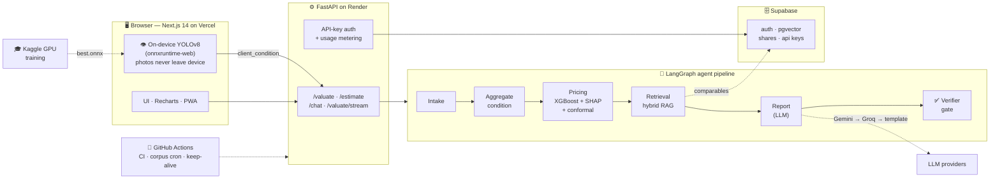
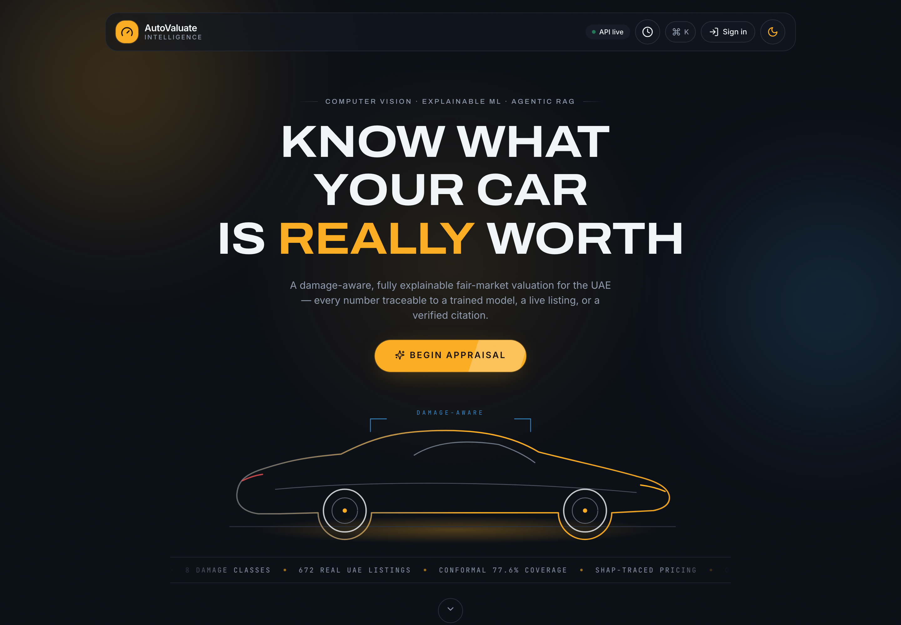
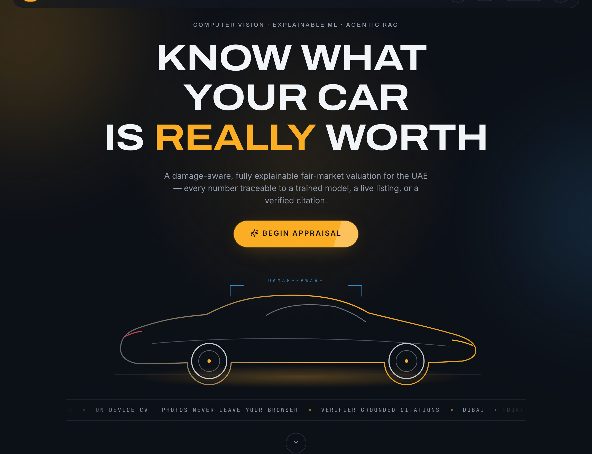
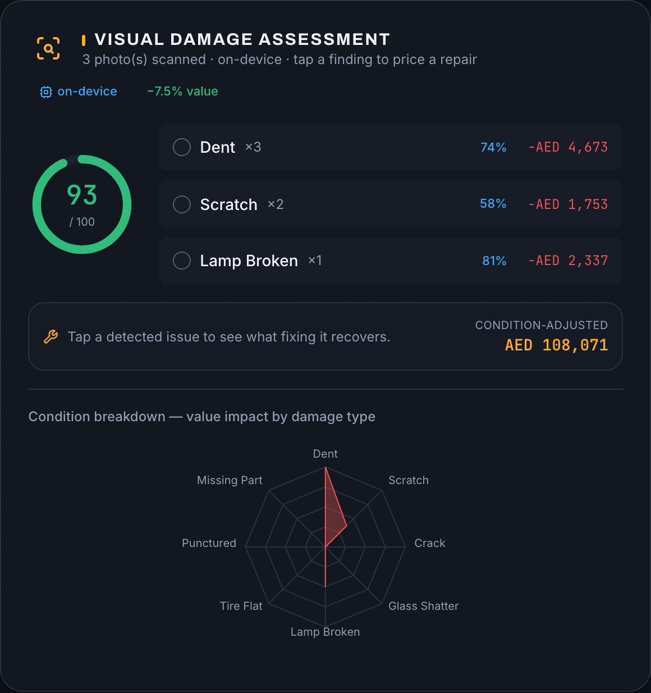
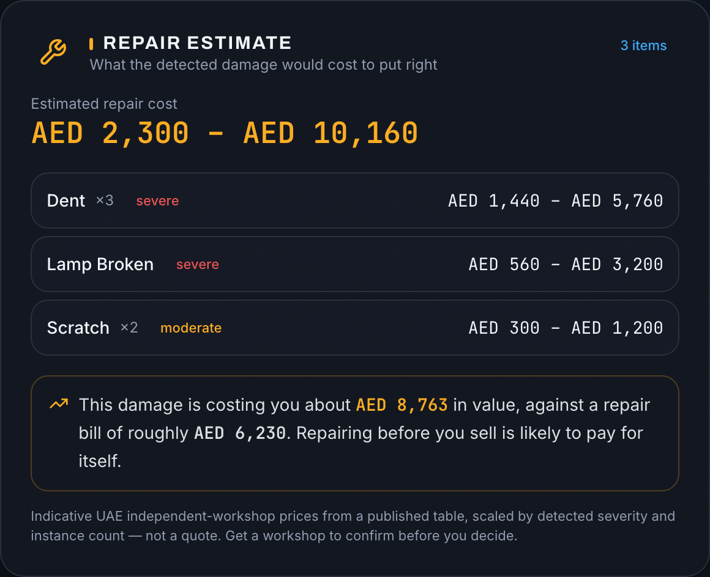
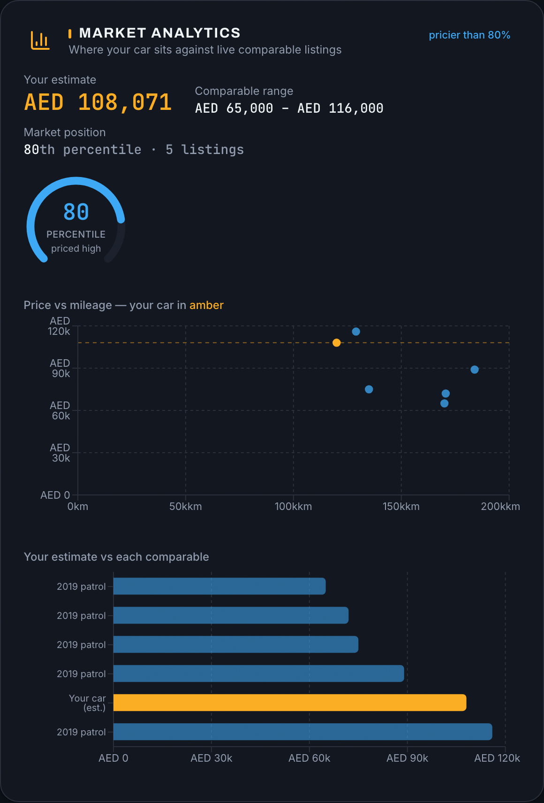
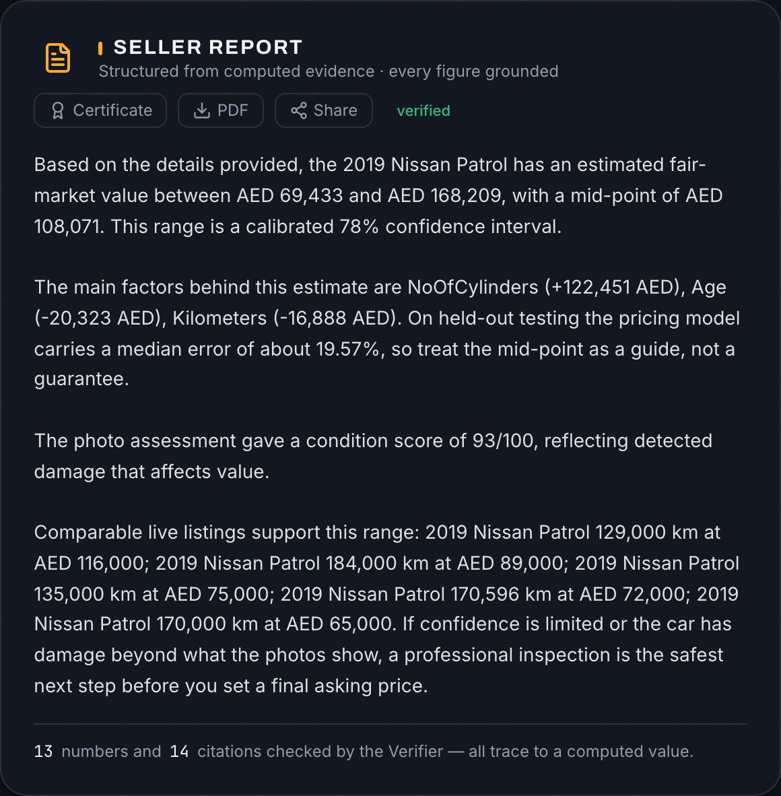
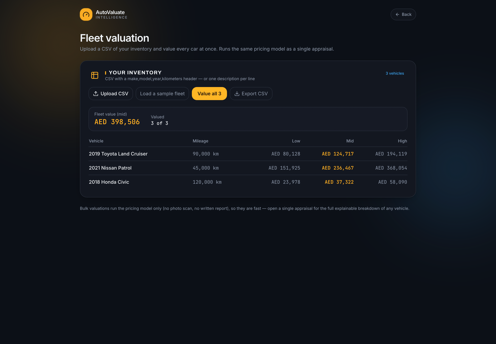
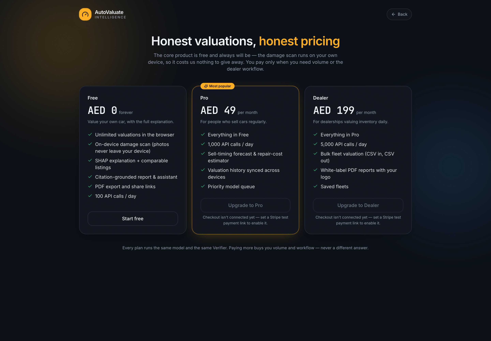

<div align="center">

# AutoValuate Intelligence

### Explainable, damage-aware used-car valuation for the UAE

*Snap a few photos, add a few details, and get an instant fair-market value you can actually defend — with the reasoning shown, not hidden. A trained damage detector runs **on your device**, an explainable model prices the car, live comparables ground it, and every number in the report is checked before you see it.*

**Computer Vision · Explainable ML · Agentic RAG — on a 100% free-tier stack**

[](https://auto-valuate-intelligence.vercel.app)
[](docs/RESEARCH.md)
[](eval/faithfulness_report.json)
[](#accessibility--responsiveness)

</div>

---

## 🔗 Live

| Surface | URL |
|---|---|
| **Web app** | **https://auto-valuate-intelligence.vercel.app** |
| **Valuation API** | https://autovaluate-api.onrender.com |
| **Public model report card** | [/model](https://auto-valuate-intelligence.vercel.app/model) — live eval metrics |

> The free-tier API sleeps after 15 min idle; a keep-alive workflow pings it, and the app shows a clear loading state on cold start. If the backend is ever unreachable it falls back to a labelled demo result, so the link is never blank.

---

## What it does

Three AI systems work together, and the final report cites every claim back to the model that produced it.

| System | What it is | How it's honest |
|---|---|---|
| **👁 Damage detection** | YOLOv8-small fine-tuned on 15,621 images (CarDD + VehiDE), 8 damage classes | Runs **in the browser** via ONNX — photos never leave your device (enforced by test, not convention). mAP@0.5 = **0.732** on a **validation subset, not a held-out test set**, covering only 6 of the 8 classes — see [`docs/CV_FINDINGS.md`](docs/CV_FINDINGS.md) |
| **📈 Explainable pricing** | XGBoost quantile regression on log-price, with **SHAP** attribution | **Split-conformal** confidence interval calibrated on held-out data (80.0% coverage) — no false precision |
| **🔍 Comparable retrieval** | Hybrid RAG: sentence embeddings + BM25 + structured similarity over real Dubizzle listings | Same-make preference; retriever proven at its data-limited ceiling (see [research](docs/RESEARCH.md)) |
| **🧾 Report + assistant** | LLM writes the report and answers questions (Gemini → Groq → deterministic fallback) | A **Verifier** rejects any number that doesn't trace to a computed value — faithfulness **1.000** |

---

## Features

**For sellers (free, forever)**
- Instant valuation with a **SHAP breakdown** of every price driver
- **On-device damage scan** + a guided "walk-around" capture flow
- **Repair-cost estimator** with a *worth-fixing?* verdict
- **Sell-timing forecast** — this car aged forward through the real model
- **Market analytics** — price-vs-mileage, market-position gauge, comparables (dark/light, responsive)
- **Grounded chat assistant** and a citation-checked written report
- **PDF export**, **shareable public links** with social preview cards, an **appraisal certificate**
- "**Describe your car**" plain-English intake · **installable PWA** (scanner works offline)

**For businesses (paid tiers)**
- **Dealer fleet valuation** — bulk CSV in, valued CSV out (`/dealer`)
- **Developer API** with keys + per-tier usage metering (`/developers`)
- **Plans** Free / Pro / Dealer (`/pricing`, Stripe test-mode) · **white-label PDF** reports

---

## Architecture



**Deep-learning & ML applied:** CNN object detection · transfer learning · IoU/NMS · mAP · ONNX quantization · gradient-boosted trees · quantile regression · **split-conformal prediction** · **SHAP** · sentence embeddings · BM25 · cross-encoder reranking · LangGraph agents · retrieval-augmented generation · deterministic verification.

---

## Screenshots

<table>
<tr>
<td width="50%"><br/><sub><b>Cinematic hero</b> — self-drawing GT line-art, live telemetry ticker</sub></td>
<td width="50%"><br/><sub><b>Explainable valuation</b> — SHAP shows every price driver in AED</sub></td>
</tr>
<tr>
<td><br/><sub><b>On-device damage scan</b> — YOLOv8 in the browser + severity radar</sub></td>
<td><br/><sub><b>Repair estimate</b> — itemised cost + a worth-fixing verdict</sub></td>
</tr>
<tr>
<td><br/><sub><b>Market analytics</b> — price-vs-mileage, market-position gauge</sub></td>
<td><br/><sub><b>Grounded report</b> — every figure checked by the Verifier</sub></td>
</tr>
<tr>
<td><br/><sub><b>Dealer fleet valuation</b> — bulk CSV in, valued CSV out</sub></td>
<td><br/><sub><b>Plans & pricing</b> — Free / Pro / Dealer, metered API</sub></td>
</tr>
</table>

---

## Results & honest evaluation

| Metric | Value | Source |
|---|---:|---|
| CV detection — mAP@0.5 | **0.732** | `eval/cv_eval_report.json` |
| Report faithfulness | **1.000** | `eval/faithfulness_report.json` |
| Conformal coverage (target 80%) | **80.0%** | `eval/uncertainty_study.json` |
| Retrieval same-make P@5 (easy bench) | **1.000** | `eval/comparables_eval.json` |
| Accessibility (axe-core, 6 pages) | **0** violations | WCAG 2.1 AA |

Two research findings — both argued *against* the obvious design choice — are written up in **[docs/RESEARCH.md](docs/RESEARCH.md)**:
- **Uncertainty (D3):** raw quantile regression promises 80% coverage but delivers **54.8%**; the "±25% rule of thumb" delivers **56.3%**. Only split-conformal keeps its promise.
- **Retrieval (D5):** we *proved* the retriever is at its mathematical ceiling — the limit is corpus size, not the algorithm, so data growth is the only lever.

---

## Run locally

```bash
# backend
cd backend-api
python -m venv .venv && source .venv/bin/activate
pip install -r requirements.txt
USE_TF=0 uvicorn main:app --port 8000

# frontend (new terminal)
cd frontend
npm install
echo "NEXT_PUBLIC_API_URL=http://127.0.0.1:8000" > .env.local
npm run dev   # → http://localhost:3000
```

Optional: set `GEMINI_API_KEY` or `GROQ_API_KEY` for LLM-written reports (a deterministic writer is used otherwise); set `ENABLE_LOCAL_CV=1` to run the detector server-side instead of in the browser.

---

## Tests & evaluation

```bash
cd backend-api && USE_TF=0 python ../eval/faithfulness_eval.py     # grounding
USE_TF=0 python ../eval/comparables_eval.py                        # retrieval
python ../eval/uncertainty_study.py                                # D3
USE_TF=0 python ../eval/retrieval_ablation.py                      # D5
cd ../frontend && npm run build                                    # typecheck + build
```

---

## Accessibility & responsiveness

Verified with a real headless browser: **zero horizontal overflow** at 320 / 375 / 768 / 1440 px, and **zero WCAG 2.1 AA violations** (axe-core) across all six pages. Full dark/light theming; the damage scanner works offline as an installed PWA.

---

## Repository

```
frontend/        Next.js 14 app — UI, on-device CV (lib/cv-browser.ts), charts, PWA
backend-api/     FastAPI + LangGraph agents, XGBoost model, RAG, Verifier, API keys
cv-service/      trained YOLOv8 ONNX model (also served in-browser from frontend/public)
eval/            evaluation + research scripts and reports
docs/            ROADMAP · ARCHITECTURE · RESEARCH · DECISIONS · presentation (deck + script)
notebooks/       CV training + valuation EDA notebooks
data/            processed comparables corpus
```

---

## Team

**SP Jain School of Global Management — group project**

| Member | ID | Focus |
|---|---|---|
| **Krishna Mathur** | AS25DXB018 | Deep learning — the on-device damage detector |
| **Yash Petkar** | AS25DXB020 | Valuation model, data pipeline & live product build |
| **Atharva Soundankar** | AS25DXB021 | Agentic backend, orchestration & RAG retrieval |
| **[ Fourth member ]** | AS25DXB0__ | Frontend, UX & product |

---

## Licensing status

This project is licensed under **[AGPL-3.0](LICENSE)**. The damage-detection weights derive from
Ultralytics YOLOv8 (AGPL-3.0), and this repository is public, so AGPL is the honest declaration
rather than a choice made for convenience — see [`docs/LICENSING.md`](docs/LICENSING.md).

AGPL permits charging money; it does not permit withholding source from network users. Closed-
source commercial use would still require an Ultralytics Enterprise License or a permissively
licensed replacement detector. Until that is decided, payments stay in Stripe **test mode**.

---

<div align="center">

*An automated estimate — not a certified appraisal. Every figure traces back to a computed value.*

</div>
