<div align="center">

# AutoValuate Intelligence

### Explainable, damage-aware used-car valuation for the UAE

*Snap a few photos, add a few details, and get an instant fair-market value you can actually defend — with the reasoning shown, not hidden. A trained damage detector runs **on your device**, an explainable model prices the car, live comparables ground it, and every number in the report is checked before you see it.*

**Computer Vision · Explainable ML · Agentic RAG — on a 100% free-tier stack**

[](https://auto-valuate-intelligence.vercel.app)
[](docs/RESEARCH.md)
[](eval/faithfulness_report.json)
[](#accessibility--responsiveness)

</div>

---

## 🔗 Live

| Surface | URL |
|---|---|
| **Web app** | **https://auto-valuate-intelligence.vercel.app** |
| **Valuation API** | https://autovaluate-api.onrender.com |
| **Public model report card** | [/model](https://auto-valuate-intelligence.vercel.app/model) — live eval metrics |
| **Deck & script** | [`docs/presentation/`](docs/presentation/) — 15 slides + a ~20-minute speaker script |

> The free-tier API sleeps after 15 min idle; a keep-alive workflow pings it, and the app shows a clear loading state on cold start. If the backend is ever unreachable it falls back to a labelled demo result, so the link is never blank.

---

## What it does

Four models work together, and the final report cites every claim back to the model that produced it.

| System | What it is | How it's honest |
|---|---|---|
| **👁 Damage detection** | YOLOv8-small fine-tuned on 14,437 training images (CarDD + VehiDE; 15,621 with validation), 8 damage classes | Runs **in the browser** via ONNX — photos never leave your device (enforced by test, not convention). mAP@0.5 = **0.732** on a **validation subset, not a held-out test set**, covering only 6 of the 8 classes — see [`docs/CV_FINDINGS.md`](docs/CV_FINDINGS.md) |
| **📷 Capture coaching** | YOLOX-Nano (Apache-2.0, 3.5 MB) locates the car in each photo as it's taken | Tells you *"step closer"*, *"cut off"*, *"blurry"*, *"too dark"* before a bad photo reaches the scan. **Advisory only** — it runs in its own session and can never touch a score |
| **📈 Explainable pricing** | XGBoost `reg:squarederror` on `log1p(price)` with monotone constraints on age and mileage, joined to vehicle specs, with **SHAP** attribution | **Split-conformal** interval, calibrated per brand tier (Mondrian): **79%** measured against an 80% promise. Quantile regression was *rejected* — it silently ignores monotone constraints (see [research](docs/RESEARCH.md) B4) |
| **🔍 Comparable retrieval** | Hybrid RAG: sentence embeddings + BM25 + structured similarity over real Dubizzle listings | Same-make preference; retriever proven at its data-limited ceiling (see [research](docs/RESEARCH.md)) |
| **🧾 Report + assistant** | LLM writes the report and answers questions (Gemini → Groq → deterministic fallback) | A **Verifier** rejects any number that doesn't trace to a computed value — faithfulness **1.000**, and a deliberately corrupted control scores **0.00** |

---

## Features

Everything below is **free** — there are no paid tiers, no accounts, no sign-up. (Paid plans were
removed while the project's AGPL-3.0 licensing question is open; see [Licensing status](#licensing-status).)

**Value it**
- Instant valuation with a **SHAP breakdown** of every price driver
- **On-device damage scan** + a guided "walk-around" flow, now with **live capture coaching** that catches a bad photo while you're still stood next to the car
- **Repair-cost estimator** with a *worth-fixing?* verdict
- **Market analytics** — price-vs-mileage, market-position gauge, comparables (states its own limits when a model is too rare to chart)
- **Depreciation curve** and a **sell-timing forecast** — this car aged forward through the real model

**Decide on it**
- **Deal score** — your asking price placed against the model's fair-value range. The asking price never enters the model, so it can't anchor the valuation
- **What-if explorer** — drag mileage, year or condition and re-price against the live model
- **Monthly payment estimator** — UAE banks quote a **flat rate**, so a 3% quote is really ~5.6% APR. The card shows both, and warns below the 20% regulatory minimum down payment

**Act on it**
- **Grounded chat assistant** and a citation-checked written report
- **Negotiation coach** (buyer and seller modes) and a ready-to-paste **listing pack**
- **Send to WhatsApp** — the report link, negotiation script or listing, straight into the chat where UAE car deals actually happen
- **PDF export**, **shareable public links** with social preview cards, an **appraisal certificate**
- "**Describe your car**" plain-English intake · **installable PWA** (scanner works offline)

**Dealer & developer**
- **Compare up to four cars** side by side, ranked by discount to fair value, not sticker price (`/compare`)
- **Dealer fleet valuation** — bulk CSV in, valued CSV out (`/dealer`)
- **Open API** — no key, no account, rate-limited per IP (`/developers`)

---

## Architecture

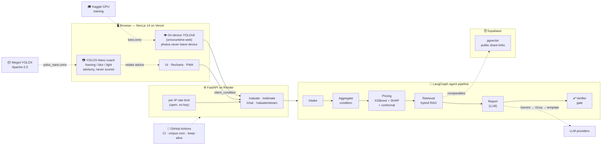
```mermaid
flowchart LR
    subgraph Client["🖥️ Browser — Next.js 14 on Vercel"]
        UI["UI · Recharts · PWA"]
        CV["👁 On-device YOLOv8<br/>(onnxruntime-web)<br/>photos never leave device"]
        CO["📷 YOLOX-Nano coach<br/>framing / blur / light<br/>advisory, never scored"]
    end

    subgraph API["⚙️ FastAPI on Render"]
        EP["/valuate · /estimate<br/>/chat · /valuate/stream"]
        RL["per-IP rate limit<br/>(open, no key)"]
    end

    subgraph Pipeline["🧠 LangGraph agent pipeline"]
        direction LR
        I["Intake"] --> A["Aggregate<br/>condition"]
        A --> P["Pricing<br/>XGBoost + SHAP<br/>+ conformal"]
        P --> R["Retrieval<br/>hybrid RAG"]
        R --> W["Report<br/>(LLM)"]
        W --> V["✅ Verifier<br/>gate"]
    end

    subgraph Data["🗄️ Supabase"]
        DB["pgvector<br/>public share links"]
    end

    CO -.->|"retake advice"| UI
    CV -->|"client_condition"| EP
    UI --> EP
    RL --> EP
    EP --> Pipeline
    R -.->|comparables| DB
    W -.->|"Gemini → Groq → template"| LLM["LLM providers"]

    Train["🎓 Kaggle GPU<br/>training"] -.->|best.onnx| CV
    Zoo["📦 Megvii YOLOX<br/>Apache-2.0"] -.->|yolox_nano.onnx| CO
    GH["🔁 GitHub Actions<br/>CI · corpus cron · keep-alive"] -.-> API
```

**Deep-learning & ML applied:** CNN object detection · transfer learning · IoU / NMS · Weighted Box Fusion · mAP · in-browser ONNX inference (WASM, two independent models) · image-quality signals (Laplacian variance, luminance) · gradient-boosted trees with monotone constraints · **split-conformal prediction** (Mondrian, per-tier) · **SHAP** · sentence embeddings · BM25 · structured-similarity retrieval · LangGraph agents · retrieval-augmented generation · deterministic verification.

---

## Screenshots

*Captured from the live deployment, not a dev build.*

<table>
<tr>
<td width="50%">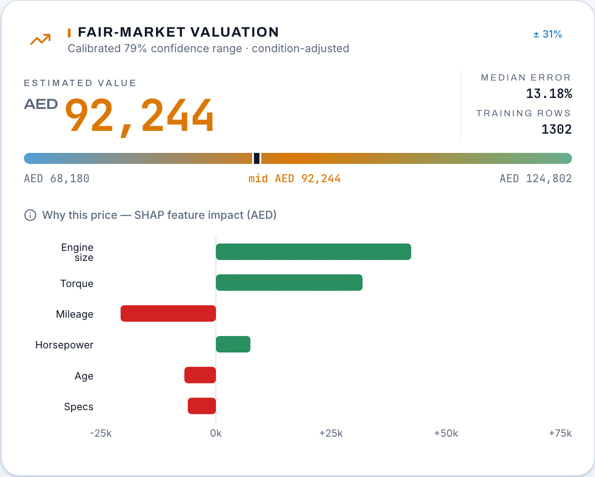<br/><sub><b>Explainable valuation</b> — SHAP shows every price driver in AED</sub></td>
<td width="50%">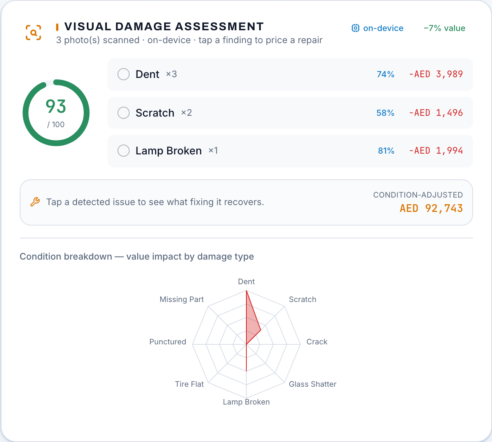<br/><sub><b>On-device damage scan</b> — YOLOv8 in the browser + severity radar</sub></td>
</tr>
<tr>
<td>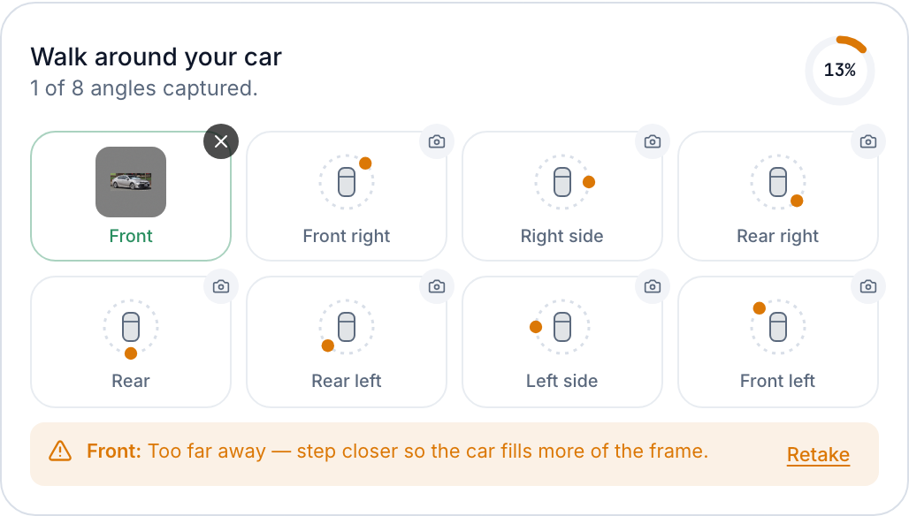<br/><sub><b>Capture coaching</b> — a bad photo is caught before it reaches the scan</sub></td>
<td>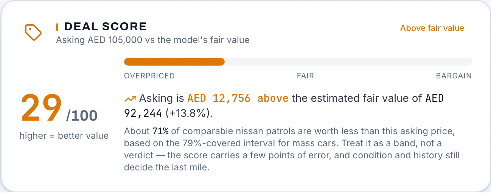<br/><sub><b>Deal score</b> — the asking price against the model's fair-value range</sub></td>
</tr>
<tr>
<td>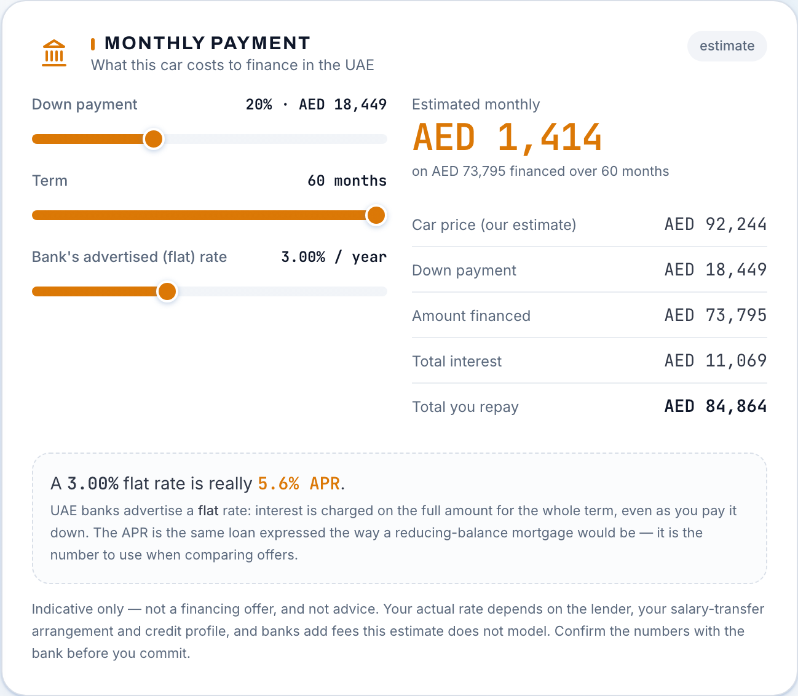<br/><sub><b>Monthly payment</b> — a flat rate is not an APR, so it shows both</sub></td>
<td>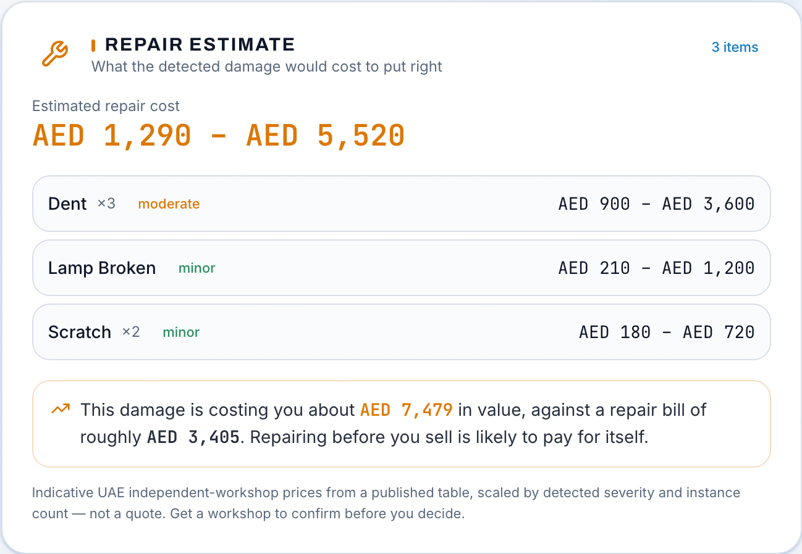<br/><sub><b>Repair estimate</b> — itemised cost + a worth-fixing verdict</sub></td>
</tr>
<tr>
<td>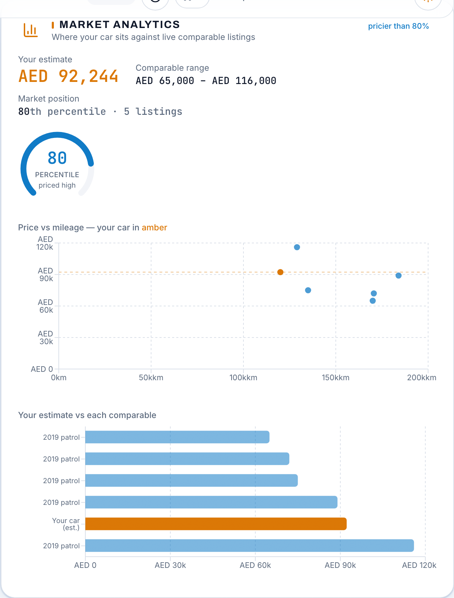<br/><sub><b>Market analytics</b> — price-vs-mileage, market-position gauge</sub></td>
<td>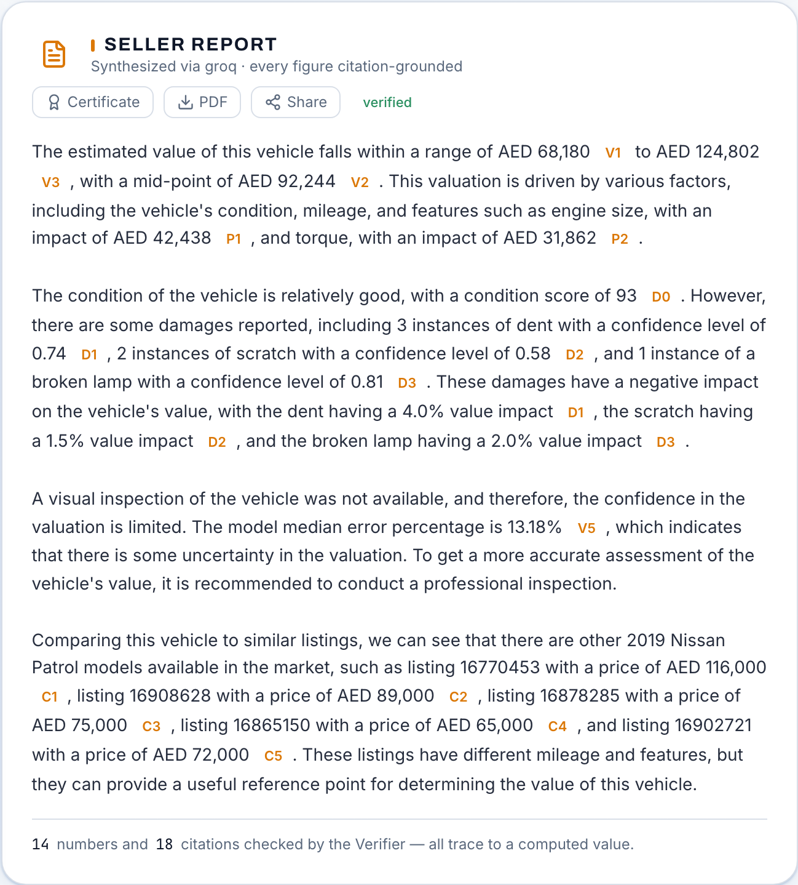<br/><sub><b>Grounded report</b> — every figure checked by the Verifier</sub></td>
</tr>
<tr>
<td>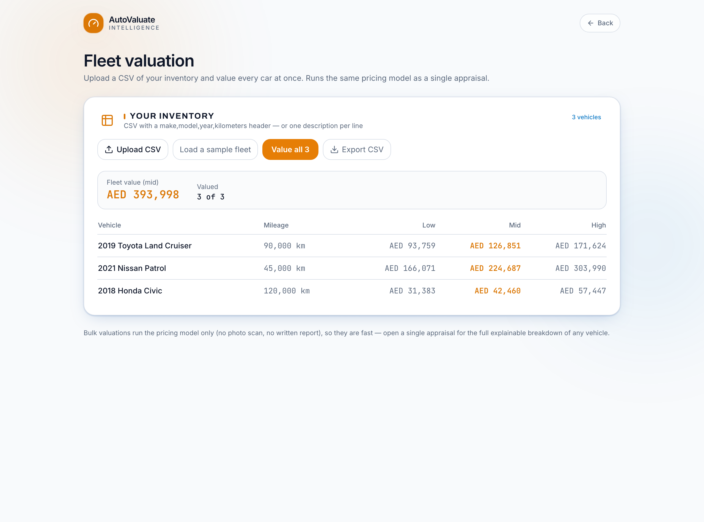<br/><sub><b>Dealer fleet valuation</b> — bulk CSV in, valued CSV out</sub></td>
<td>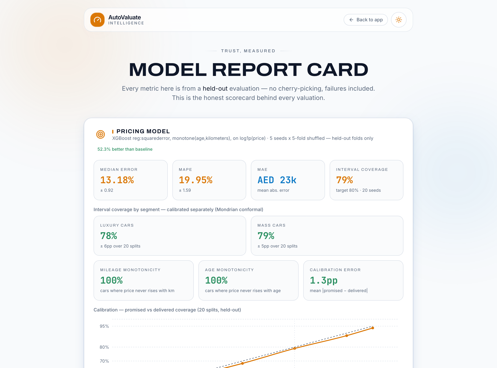<br/><sub><b>Model report card</b> — every metric, published live at <code>/model</code></sub></td>
</tr>
</table>

---

## Results & honest evaluation

Every figure here is reproducible from a committed script + JSON — nothing is quoted from memory.

| Metric | Value | Source |
|---|---:|---|
| Pricing — median APE | **13.18%** | `eval/valuation_metrics.json` |
| Pricing — conformal coverage (target 80%) | **79%** | `eval/valuation_metrics.json` |
| Pricing — improvement over make+model baseline | **+52.3%** | `eval/valuation_metrics.json` |
| Pricing — vehicles matched to physical specs | **81.0%** | `eval/valuation_metrics.json` |
| Report faithfulness (corrupted control: 0.00) | **1.000** | `eval/faithfulness_report.json` |
| Retrieval same-make P@5 (benchmark) | **1.000** | `eval/comparables_eval.json` |
| CV detection — mAP@0.5 | **0.732** *(see caveat)* | `eval/cv_train_summary.json` |
| Accessibility (axe-core, 6 pages) | **0** violations | WCAG 2.1 AA |
| Scoring parity (browser == backend) | **56/56 cases** | `eval/cv_scoring.py` |
| Committed test suite | **142** (72 backend · 70 frontend) | `eval/` · `frontend/tests/` |

### What we're honest about

- **The damage scan is honest, not yet reliable.** The `0.732` mAP is on a **validation subset,
  not a held-out test set**, and covers 6 of 8 classes. More importantly, the detector is
  **unstable to framing**: on a real whole-car photo, a 3% crop can swing the condition score by
  ~47 points, because it was trained on close-up damage crops, not the wide shots users upload.
  The product handles this honestly — a scan that finds nothing reads *"unconfirmed, not clean"*
  and always advises an inspection — but the underlying accuracy needs a retrain
  ([`notebooks/09_yolo_framing_invariance_retrain.ipynb`](notebooks/09_yolo_framing_invariance_retrain.ipynb)).
  The full diagnosis, with the four downstream fixes that were tried and rejected on measurement,
  is in [`docs/CV_FINDINGS.md`](docs/CV_FINDINGS.md).
  **Capture coaching mitigates the input, not the model.** Catching a photo that is too far,
  cut off, blurry or dark stops the worst input reaching a detector that handles it badly. It
  does not make the detector framing-invariant. Only the retrain does that, and it is blocked on
  labelled whole-car UAE photos — the harness that will build that dataset is committed in
  [`uae-whole-car-labelled/`](uae-whole-car-labelled/), with no photos in it.
- **The pricing floor is data and features, not tuning.** The learning curve
  (`eval/learning_curve.py`, 25 seeds, constant 150-row test) fits `APE(n) = a·n^-b + c` for the
  old and the shipped feature sets, paired on identical splits. The spec join moved the
  asymptote **10.36% → 6.87%** — so the ~8% figure quoted for larger markets went from
  *unreachable at any corpus size* to reachable, and hyperparameter search still isn't the
  lever. Indicative rows needed on the shipped curve: **~5.9k for 10%**, **~14k for 9%**. The
  weekly scrape (`.github/workflows/scrape-comparables.yml`) is what closes that gap.
- **The spec-join accuracy gain is now shipped.** `eval/spec_join_study.py` found joining
  vehicle physical specs (hp, torque, l/100km, 0–100, top speed, weight) drops median APE by a
  paired, bootstrapped, permutation-controlled **+2.4pp** (verdict: ADOPT). The shipped bundle
  is now trained with it: **15.65% → 13.18%**, at an **81.0%** spec match rate. The join needs
  `data/raw/DriveArabia_All_uae.csv` (gitignored, Kaggle-downloaded) **only at train time** —
  the aggregated spec table is baked into `valuation_model.joblib`, so inference never needs the
  CSV. A fresh clone without it retrains to the un-joined 15.64% instead of failing;
  `spec_join_active` in the bundle and in `valuation_metrics.json` records which path produced
  the artifact.

Two research findings — both argued *against* the obvious design choice — are written up in **[docs/RESEARCH.md](docs/RESEARCH.md)**:
- **Uncertainty (D3):** raw quantile regression promises 80% coverage but delivers **54.8%**; the "±25% rule of thumb" delivers **56.3%**. Only split-conformal keeps its promise.
- **Retrieval (D5):** we *proved* the retriever is at its mathematical ceiling — the limit is corpus size, not the algorithm, so data growth is the only lever.

---

## Run locally

```bash
# backend
cd backend-api
python -m venv .venv && source .venv/bin/activate
pip install -r requirements.txt
USE_TF=0 uvicorn main:app --port 8000

# frontend (new terminal)
cd frontend
npm install
echo "NEXT_PUBLIC_API_URL=http://127.0.0.1:8000" > .env.local
npm run dev   # → http://localhost:3000
```

Optional: set `GEMINI_API_KEY` or `GROQ_API_KEY` for LLM-written reports (a deterministic writer is used otherwise); set `ENABLE_LOCAL_CV=1` to run the detector server-side instead of in the browser.

---

## Tests & evaluation

```bash
python eval/unit_tests.py            # 72 backend guardrail + contract tests
python eval/cv_scoring.py            # scoring bands + browser==backend parity (56 cases)
python eval/cv_conformance.py        # browser/backend post-processing parity
python eval/faithfulness_eval.py     # report grounding (Verifier)
python eval/spec_join_study.py       # the +2.4pp spec-join result, with a permutation control
python eval/learning_curve.py        # data-vs-features asymptote, both feature sets, paired
python scripts/stability_check.py <photo>   # framing-stability of the damage scan

cd frontend && npx playwright test   # 70 frontend tests (UI, CV e2e, pure-logic units)
node scripts/cv-determinism-run.mjs && npm run build   # determinism + build
```

The CV gate (`.github/workflows/cv-gate.yml`) runs the scoring, conformance, determinism and
contract suites on every change that touches the detector; Frontend CI runs the browser suite
on every push.

The pure-logic suites are deliberately written as Playwright tests rather than pulling in a
second test framework: `financing.spec.ts` pins the flat-rate arithmetic (including a control
where a known 6% reducing-balance loan must solve back to 6.0000%), `capture-quality.spec.ts`
pins the coaching thresholds against measured values, and `share-targets.spec.ts` pins the
URL encoding that a UAE listing full of newlines and `AED` would otherwise break.

---

## Accessibility & responsiveness

Verified with a real headless browser: **zero horizontal overflow** at 320 / 375 / 768 / 1440 px, and **zero WCAG 2.1 AA violations** (axe-core) across all six pages. Full dark/light theming; the damage scanner works offline as an installed PWA.

---

## Repository

```
frontend/                 Next.js 14 app — UI, on-device CV (lib/cv-browser.ts),
                          capture coaching (lib/cv/capture-quality.ts), charts, PWA
backend-api/              FastAPI + LangGraph agents, XGBoost model, RAG, Verifier
cv-service/               trained YOLOv8 ONNX model (also served in-browser from frontend/public)
eval/                     evaluation + research scripts and reports (the source of every number above)
scripts/                  corpus scraping, CV diagnostics, framing-stability check
docs/                     ARCHITECTURE · RESEARCH · CV_INFERENCE_SPEC · CV_FINDINGS · LICENSING
docs/presentation/        the deck, its build script and the screenshots it uses
notebooks/                CV training/retraining + valuation EDA notebooks
uae-whole-car-labelled/   harness for the blocked CV retrain: download, validate,
                          split and QA tooling — no photographs are included
data/                     processed comparables corpus
.github/workflows/        CI gates, weekly corpus scrape, keep-alive crons
```

---

## Team

**SP Jain School of Global Management — group capstone**

**Krishna Mathur** · **Atharva Soundankar** · **Yash Petkar** · **Sarth Malankar** · **Krish Kumar**

The work spanned five threads: the on-device damage detector, the valuation model and data
pipeline, the agentic backend and RAG layer, the frontend and product surface, and the
evaluation harness that keeps every number in this README honest.

---

## Licensing status

This project is licensed under **[AGPL-3.0](LICENSE)**. The damage-detection weights derive from
Ultralytics YOLOv8 (AGPL-3.0), and this repository is public, so AGPL is the honest declaration
rather than a choice made for convenience — see [`docs/LICENSING.md`](docs/LICENSING.md).

AGPL permits charging money; it does not permit withholding source from network users. Closed-
source commercial use would still require an Ultralytics Enterprise License or a permissively
licensed replacement detector. Until that is decided, the product ships **free, with no paid
plans** — the pricing tiers and payment flow were removed rather than advertised.

**We deliberately stopped the problem growing.** The capture coach needed a second object
detector, and the obvious pick was YOLOv8n — same toolchain, same export path. It is also
AGPL, which would have meant a future commercial pivot had to replace *two* models instead of
one. We used [YOLOX-Nano](https://github.com/Megvii-BaseDetection/YOLOX) (Megvii, Apache-2.0)
instead, redistributed unmodified with source, hash and copyright recorded in
[`frontend/public/models/YOLOX-NOTICE.md`](frontend/public/models/YOLOX-NOTICE.md). Every
component added since the licensing question opened is permissively licensed.

---

<div align="center">

*An automated estimate — not a certified appraisal. Every figure traces back to a computed value.*

</div>
